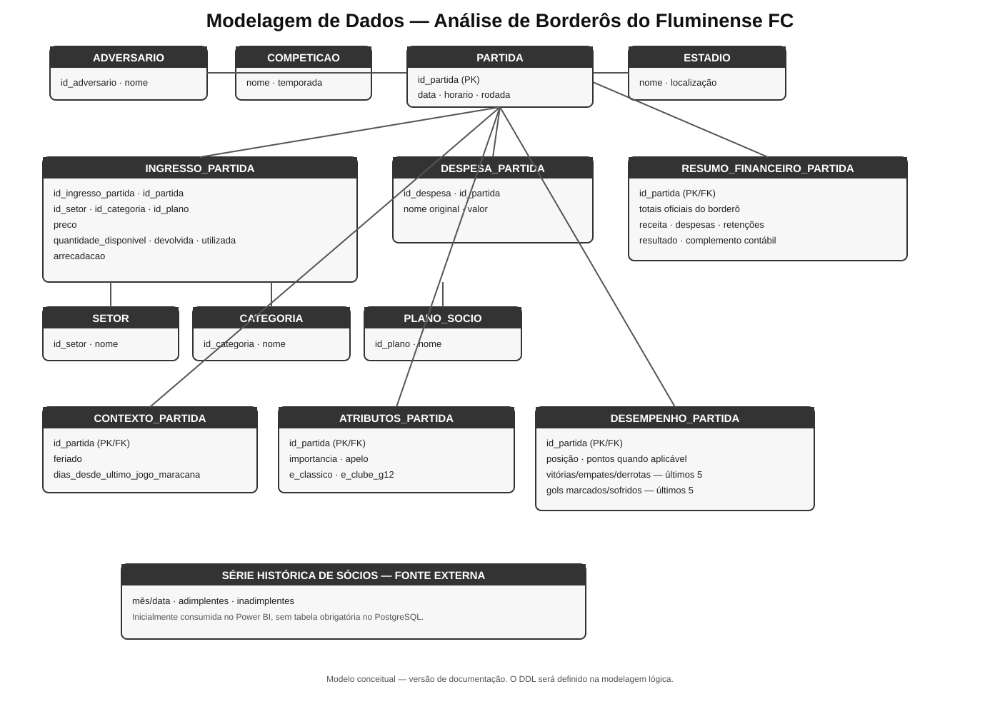

# Análise de Borderôs do Fluminense FC

Projeto de análise de dados voltado ao estudo da relação entre **preços de ingressos, público, arrecadação e contexto das partidas do Fluminense FC**, utilizando dados de borderôs de jogos realizados como mandante.

O projeto busca construir uma base de dados estruturada a partir dos borderôs e integrá-la posteriormente a outras fontes de informação, permitindo análises exploratórias e estatísticas sobre a **demanda por ingressos, ocupação e desempenho financeiro das partidas**.

> **Status:** Em desenvolvimento

---

## 🎯 Objetivo

Investigar como diferentes fatores relacionados às partidas podem estar associados ao comportamento do público e à arrecadação de bilheteria.

Entre os fatores analisados ou previstos estão:

* preço dos ingressos;
* quantidade de ingressos disponíveis;
* ingressos devolvidos;
* ingressos utilizados;
* arrecadação;
* setores do estádio;
* categorias de ingresso;
* planos de sócio;
* adversário;
* competição;
* fase ou rodada da competição;
* importância esportiva da partida;
* apelo do adversário;
* desempenho recente do Fluminense;
* posição das equipes;
* dia e horário da partida;
* ocorrência de feriado;
* intervalo desde o último jogo no Maracanã;
* características do confronto, como clássico;
* relevância histórica/esportiva do adversário, representada por critérios como pertencimento ao G12.

O projeto também pretende investigar diferentes faixas de preço e seus possíveis efeitos sobre **público, ocupação e receita**, considerando diferentes contextos de partida.

> Variáveis como importância da partida e apelo do adversário serão construídas por meio de critérios metodológicos próprios, documentados no projeto.

---

## 📊 Fonte dos dados

A principal fonte de dados será constituída pelos **borderôs das partidas do Fluminense FC**, disponibilizados publicamente pelo clube.

Os borderôs contêm informações financeiras e de bilheteria das partidas, incluindo dados relacionados a:

* setores;
* categorias de ingresso;
* planos de sócio;
* preços;
* quantidade de ingressos disponíveis;
* ingressos devolvidos;
* ingressos utilizados;
* arrecadação;
* despesas relacionadas à operação da partida;
* retenções;
* resultado financeiro.

Os documentos serão utilizados como **fonte primária para a construção da base de dados**.

Informações que não estejam disponíveis nos borderôs poderão ser obtidas em fontes complementares, de acordo com a metodologia definida para cada variável.

---

## 🗄️ Arquitetura dos dados

Os dados não serão armazenados diretamente no formato dos PDFs.

A proposta é transformar as informações dos borderôs em uma estrutura relacional utilizando **PostgreSQL**, permitindo posteriormente sua utilização em ferramentas de Business Intelligence.

Fluxo planejado:

```text
Borderôs
   ↓
Extração e padronização
   ↓
Modelagem dos dados
   ↓
PostgreSQL
   ↓
Integração com outras fontes
   ↓
Tratamento e transformação
   ↓
Análises
   ↓
Power BI
```

Os PDFs originais serão tratados como fontes documentais/raw, enquanto os dados estruturados serão armazenados no banco de dados.

---

## 🧩 Modelagem dos dados

A documentação detalhada está em [docs/04_modelagem.md](docs/04_modelagem.md) e o dicionário completo em [docs/03_dicionario_dados.md](docs/03_dicionario_dados.md).



A modelagem busca separar entidades e eventos que possuem significados diferentes, evitando tanto a duplicação desnecessária de informações quanto uma normalização excessiva.

A estrutura conceitual atual contempla:

```text
PARTIDA
│
├── ADVERSARIO
├── COMPETICAO
├── ESTADIO
│
├── INGRESSO_PARTIDA
│   ├── SETOR
│   ├── CATEGORIA_INGRESSO
│   └── PLANO_SOCIO
│
├── DESPESA_PARTIDA
│
├── CONTEXTO_PARTIDA
│
├── ATRIBUTOS_PARTIDA
│
└── DESEMPENHO_PARTIDA

SNAPSHOT_SOCIOS
```

### Partida

A entidade `PARTIDA` representa o evento esportivo e funciona como elemento central do modelo.

Entre seus principais atributos estão:

* data;
* horário;
* adversário;
* competição;
* estádio;
* rodada/fase.

### Ingressos

As informações de bilheteria são estruturadas em diferentes níveis:

* **setor** — localização do ingresso no estádio;
* **categoria** — inteira, meia ou sócio;
* **plano de sócio** — detalhamento da categoria de sócio;
* **ingresso por partida** — combinação entre partida, setor, categoria e, quando aplicável, plano de sócio.

A tabela `INGRESSO_PARTIDA` concentra informações específicas daquela oferta de ingresso na partida, como:

* preço;
* quantidade disponível;
* quantidade devolvida;
* quantidade utilizada;
* arrecadação.

Essa estrutura permite analisar, por exemplo, como diferentes preços e categorias se comportam dentro de cada setor.

### Despesas

As despesas são armazenadas diretamente em `DESPESA_PARTIDA`.

Cada registro representa uma linha de despesa apresentada no borderô, preservando sua nomenclatura original:

```text
id_despesa
id_partida
nome
valor
```

Não será criada inicialmente uma entidade separada de `TIPO_DESPESA`, pois isso acrescentaria uma camada de normalização sem necessidade para a estrutura atual.

Caso análises futuras exijam agrupamentos das despesas, classificações poderão ser criadas posteriormente na camada de transformação ou análise.

---

## 🌐 Contexto da partida

O contexto representa condições circunstanciais da realização da partida.

A estrutura atual contempla:

```text
CONTEXTO_PARTIDA

- id_partida
- feriado
- dias_desde_ultimo_jogo_maracana
```

Variáveis como dia da semana e mês não precisam necessariamente ser armazenadas, pois podem ser derivadas diretamente da data da partida.

Informações climáticas, como temperatura e precipitação, foram inicialmente consideradas, mas foram retiradas do escopo devido à dificuldade de obter dados históricos consistentes para partidas mais antigas.

---

## ⭐ Atributos da partida

Os atributos da partida representam características utilizadas para avaliar o potencial de interesse e relevância do confronto.

A estrutura atual contempla:

```text
ATRIBUTOS_PARTIDA

- id_partida
- importancia_partida
- apelo_adversario
- e_classico
- e_clube_g12
```

### Importância da partida

`importancia_partida` será representada por uma escala de **0 a 10**.

A pontuação buscará considerar fatores como:

* competição;
* fase da competição;
* situação do Fluminense na competição;
* disputa por título;
* disputa por classificação;
* disputa por vagas em competições;
* disputa contra rebaixamento;
* caráter eliminatório;
* proximidade de uma decisão;
* importância específica daquele confronto dentro da competição.

A escala terá caráter **metodológico e analítico**, e não oficial.

Como princípio inicial, competições e fases mais relevantes terão maior peso, mas a situação específica da partida poderá alterar sua pontuação.

Por exemplo:

* amistoso tende a apresentar baixa importância;
* partida comum do Carioca tende a apresentar baixa importância;
* partidas de mata-mata possuem importância crescente conforme avançam as fases;
* uma partida de Brasileirão pode receber pontuação elevada quando estiver diretamente relacionada a uma disputa importante;
* finais e decisões de grande relevância podem atingir pontuação próxima de 10.

A metodologia definitiva de pontuação será documentada antes da aplicação ao conjunto completo de partidas.

### Apelo do adversário

`apelo_adversario` também será representado por uma escala de **0 a 10**.

A avaliação considera a relevância do adversário no contexto histórico em que a partida ocorreu.

Entre os fatores considerados estão:

* força e relevância nacional;
* relevância continental;
* tamanho e tradição do clube;
* participação em disputas relevantes;
* condição de clube emergente;
* pertencimento ao G12;
* relevância histórica do confronto;
* contexto esportivo do adversário no período analisado.

A classificação não será fixa para todos os períodos históricos. Um clube que possua pouca relevância em determinado período poderá apresentar maior apelo em outro momento caso sua importância esportiva aumente.

Como referência geral, a hierarquia tende a considerar:

```text
Grandes clubes nacionais / principais clássicos
        ↓
Grandes clubes continentais
        ↓
Clubes nacionais fortes ou emergentes
        ↓
Clubes internacionais emergentes
        ↓
Clubes de menor expressão
        ↓
Clubes de baixa relevância nacional/continental
```

Essa classificação será documentada e aplicada de maneira consistente.

### Clássico

`e_classico` representa se o confronto é considerado um clássico para fins da metodologia.

Valor:

```text
0 = não
1 = sim
```

### Clube do G12

`e_clube_g12` identifica se o adversário pertence ao grupo de clubes definido como G12 para a metodologia do projeto.

Valor:

```text
0 = não
1 = sim
```

O G12 funciona como uma variável objetiva complementar ao índice de `apelo_adversario`, não substituindo a avaliação contextual do adversário.

---

## ⚽ Desempenho da partida

O desempenho esportivo será tratado separadamente dos atributos de importância e apelo.

A estrutura inicial considera informações como:

* posição do Fluminense antes da partida;
* pontos do Fluminense;
* resultados recentes;
* vitórias nos últimos jogos;
* empates nos últimos jogos;
* derrotas nos últimos jogos;
* gols marcados recentemente;
* gols sofridos recentemente.

Essa estrutura poderá ser refinada posteriormente para incorporar também informações equivalentes do adversário.

A separação entre desempenho e importância permite distinguir, por exemplo:

> **como o Fluminense estava jogando**

de:

> **o quanto aquela partida era importante naquele momento**.

---

## 👥 Sócio-torcedor

O Portal da Transparência disponibiliza uma série histórica mensal de sócios adimplentes e inadimplentes. Neste momento, essa série será tratada como **fonte externa para o Power BI**, sem uma tabela obrigatória no PostgreSQL.

A decisão poderá ser revista posteriormente caso a integração ao banco traga benefício analítico.

Além disso, os próprios borderôs permitirão analisar a participação de diferentes categorias de sócios nos ingressos.

---

## 📈 Análises planejadas

### Demanda

* relação entre preço e público;
* taxa de utilização dos ingressos disponíveis;
* taxa de ocupação do estádio;
* composição do público por categoria;
* comportamento da demanda por setor;
* participação dos sócios no público;
* comportamento da demanda em diferentes contextos de partida.

### Receita

* preço médio dos ingressos;
* arrecadação por partida;
* receita por espectador;
* receita por setor;
* composição da arrecadação por categoria;
* relação entre preço, público e receita;
* impacto das despesas no resultado financeiro.

### Contexto e atributos da partida

* público × adversário;
* público × apelo do adversário;
* público × clube do G12;
* público × clássico;
* público × importância da partida;
* público × desempenho recente;
* público × posição na tabela;
* público × dia e horário;
* público × feriado;
* público × intervalo desde o último jogo no Maracanã.

A separação entre **importância da partida** e **apelo do adversário** permitirá investigar situações distintas, como:

```text
Alto apelo + baixa importância
```

versus:

```text
Baixo apelo + alta importância
```

permitindo avaliar se o comportamento do público está mais associado às características do adversário, à relevância esportiva da partida ou à combinação desses fatores.

---

## 💰 Análise de preços

Em uma etapa posterior, poderão ser utilizados modelos estatísticos para investigar a associação entre preço e demanda, controlando outros fatores relevantes.

Também poderá ser estimada a **elasticidade-preço da demanda** e simulados diferentes cenários de preço.

A análise poderá considerar diferentes níveis de:

* preço;
* setor;
* categoria;
* plano de sócio;
* importância da partida;
* apelo do adversário;
* desempenho esportivo;
* competição;
* demais fatores disponíveis.

> As análises estatísticas serão interpretadas como relações observadas nos dados. Associação entre variáveis não será automaticamente interpretada como causalidade.

---

## 🛠️ Tecnologias planejadas

* **Python** — extração, tratamento e preparação dos dados
* **PostgreSQL** — armazenamento e gerenciamento dos dados
* **SQL** — consultas e transformação dos dados
* **Power BI** — análise e visualização
* **Git/GitHub** — versionamento e documentação
* **dbdiagram.io** — modelagem e documentação do banco de dados

As ferramentas poderão ser ajustadas conforme o desenvolvimento do projeto.

---

## 📁 Estrutura planejada do repositório

```text
analise-borderos-fluminense/
│
├── README.md
│
├── docs/
│   ├── 01_objetivo.md
│   ├── 02_fontes_dados.md
│   ├── 03_modelagem.md
│   ├── 04_dicionario_dados.md
│   ├── 05_metodologia_coleta.md
│   ├── 06_tratamento_dados.md
│   ├── 07_metodologia_atributos_partida.md
│   └── 08_metodologia_analise.md
│
├── database/
│   ├── schema.sql
│   └── seeds.sql
│
├── scripts/
│   ├── extraction/
│   └── transformation/
│
├── data/
│   ├── raw/
│   └── processed/
│
└── powerbi/
    └── ...
```

---

## 📚 Documentação

A documentação detalhada do projeto está organizada em `docs/`:

- [Dicionário de dados](docs/03_dicionario_dados.md)
- [Modelagem de dados](docs/04_modelagem.md)
- [Metodologia dos atributos da partida](docs/07_metodologia_atributos_partida.md)

O diagrama da modelagem está em `images/modelo_dados.svg`.

## 🗺️ Roadmap

* [x] Definição inicial do problema
* [x] Identificação dos borderôs como fonte primária
* [x] Análise inicial da estrutura dos borderôs
* [x] Revisão inicial das entidades do modelo
* [x] Definição inicial das estruturas de contexto e atributos da partida
* [x] Definição do desempenho pré-jogo
* [x] Definição do armazenamento do resumo financeiro oficial
* [x] Definição inicial do tratamento da série histórica de sócios
* [ ] Definição final do modelo conceitual
* [ ] Definição do modelo lógico
* [ ] Definição da metodologia de `importancia_partida`
* [ ] Definição da metodologia de `apelo_adversario`
* [ ] Definição do G12 utilizado na análise
* [x] Criação do dicionário de dados
* [ ] Configuração do PostgreSQL
* [ ] Desenvolvimento da estrutura do banco
* [ ] Desenvolvimento da extração dos borderôs
* [ ] Validação dos dados extraídos
* [ ] Coleta dos borderôs
* [ ] Integração com fontes complementares
* [ ] Tratamento e transformação dos dados
* [ ] Análise exploratória
* [ ] Modelagem estatística
* [ ] Desenvolvimento do modelo no Power BI
* [ ] Construção do dashboard
* [ ] Documentação dos resultados
* [ ] Publicação do projeto como portfólio

---

## 📚 Documentação e rastreabilidade

A documentação do projeto será construída progressivamente neste repositório.

Cada etapa será registrada para manter a rastreabilidade entre:

```text
fonte
  ↓
coleta
  ↓
tratamento
  ↓
modelagem
  ↓
atributos derivados
  ↓
análise
  ↓
visualização
```

Especial atenção será dada às variáveis construídas pelo projeto, como `importancia_partida` e `apelo_adversario`.

Essas variáveis não representam informações oficiais presentes nos borderôs. São **índices analíticos construídos a partir de critérios definidos e documentados**, que deverão ser aplicados de maneira consistente ao conjunto de dados.

O objetivo é que o projeto não seja apenas um dashboard final, mas um exemplo completo de um **pipeline de análise de dados**, desde a obtenção dos dados até a geração e interpretação dos insights.

---

## ⚠️ Status dos resultados

Este projeto encontra-se em fase de desenvolvimento.

A modelagem conceitual está sendo refinada e as metodologias de construção das variáveis analíticas ainda serão definidas antes da coleta e análise completa dos dados.

As análises, conclusões e visualizações ainda não foram finalizadas.

Resultados apresentados futuramente serão baseados nos dados coletados e na metodologia documentada neste repositório.
